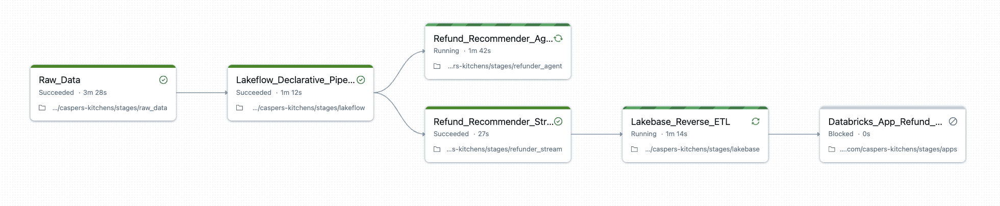

# 🍔 Casper's Kitchens

Spin up a fully working ghost-kitchen business on Databricks in minutes.

Casper's Kitchens is a simulated food-delivery platform that shows off the full power of Databricks: streaming ingestion, Lakeflow Declarative Pipelines, AI/BI Dashboards and Genie, Agent Bricks, and real-time apps backed by Lakebase postgres — all stitched together into one narrative.

## 🚀 Quick Start

1. **Import to Databricks Workspace**: Create a new Git folder in your workspace and import this repository

2. **Initialize the demo**: Run `init.ipynb` to create the "Casper's Initializer" job
   - By default the job will use the catalog `caspers`
   - **Important**: If you're working in a metastore that spans multiple workspaces and another workspace has already used the catalog name `caspers`, you'll need to specify a different name using the `CATALOG` parameter. Catalog names must be unique within a metastore.
   - By default, only the San Francisco location will generate data. To run additional locations (like Chicago) or create your own, see `data/generator/configs/README.md` and use the `LOCATIONS` parameter.

3. **Launch your ghost kitchen empire**:
   - Navigate to **Jobs & Pipelines** in the left sidebar of your Databricks workspace
   - Find and run the `Casper's Initializer` job
   - You can pick a subset of tasks to run if you want. The `Raw_Data` and `Lakeflow_Declarative_Pipeline` tasks are required, but downstream tasks are demo-specific and you can run whichever ones you need.

Then open Databricks and watch:
- 📦 Orders stream in from ghost kitchens
- 🔄 Pipelines curate raw → bronze → silver → gold
- 📊 [Dashboards](https://github.com/databricks-solutions/caspers-kitchens/issues/13) & apps come alive with real-time insights
- 🤖 AI agents handle refunds and complaints

That's it! Your Casper's Kitchens environment will be up and running.

## 🏗️ What is Casper's Kitchens?

Casper's Kitchens is a fully functional ghost kitchen business running entirely on the Databricks platform. As a ghost kitchen, Casper's operates multiple compact commercial kitchens in shared locations, hosting restaurant vendors as tenants who create digital brands to serve diverse cuisines from single kitchen spaces.

The platform serves dual purposes:
- **🎭 Narrative**: Provides a consistent business context for demos and training across the Databricks platform  
- **⚙️ Technical**: Delivers complete infrastructure for learning Databricks, running critical user journeys (CUJs), and enabling UX prototyping

The platform generates realistic order data with full order lifecycle tracking - from creation to delivery - including kitchen status updates, driver GPS coordinates, and configurable business parameters.

## 🏗️ Architecture

The system is structured as **stages** (found in `./stages/`) orchestrated by a single Databricks Lakeflow Job called "Casper's Initializer". Each stage corresponds to a task in the job (pictured above), enabling:

- **🎯 Customizable demos**: Run only the stages relevant to your use case
- **🔧 Easy extensibility**: Add new demos that integrate seamlessly under the Casper's narrative  
- **⚡ Databricks-native**: Uses Databricks itself to bootstrap the demo environment

The dependencies between stages is reflected in the job's DAG. 

You can add new stages to this DAG to extend the demo but they do not NEED to be dependent on the existing DAG if they do not actually use assets produced by other stages.

### 📊 Generated Event Types

The data generator produces the following realistic events for each order in the Volume `caspers.simulator.events`:

| Event | Description | Data Included |
|-------|-------------|---------------|
| `order_created` | Customer places order | Customer location (lat/lon), delivery address, ordered items with quantities |
| `gk_started` | Kitchen begins preparing food | Timestamp when prep begins |
| `gk_finished` | Kitchen completes food preparation | Timestamp when food is ready |
| `gk_ready` | Order ready for pickup | Timestamp when driver can collect |
| `driver_arrived` | Driver arrives at kitchen | Timestamp of driver arrival |
| `driver_picked_up` | Driver collects order | Full GPS route to customer, estimated delivery time |
| `driver_ping` | Driver location updates during delivery | Current GPS coordinates, delivery progress percentage |
| `delivered` | Order delivered to customer | Final delivery location coordinates |

Each event includes order ID, sequence number, timestamp, and location context. The system models realistic timing between events based on configurable service times, kitchen capacity, and real road network routing via OpenStreetMap data.

### 🛠️ Available Stages

**📊 Raw Data**
- Starts realistic data generators for order streams
- Configurable locations, delivery parameters, and simulation speed
- Tracks complete order lifecycle with GPS coordinates
- Default San Francisco location with easy expansion via JSON configs

**🔄 Lakeflow**
- Medallion architecture pipeline (Bronze → Silver → Gold)
- Processes and normalizes order data
- Creates summary tables for downstream consumption

**🤖 Refund Agent**
- ML model that scores orders for refund eligibility
- Uses delivery time percentiles (P50, P75, P99) for scoring
- Classifies as no refund, partial, or full refund

**⚡ Refund Agent Stream**
- Spark Streaming job for real-time refund scoring
- Processes completed orders and writes results to lakehouse

**🤖 Complaint Agent**
- AI agent that processes customer complaints using UC functions
- Classifies complaints and makes decisions (auto_credit, investigate, escalate)

**⚡ Complaint Generator Stream**
- Generates realistic customer complaints from delivered orders
- Configurable complaint rate (default 15%)

**⚡ Complaint Agent Stream**
- Processes complaints through the agent endpoint in real-time
- Writes decisions to lakehouse for downstream consumption

**🗄️ Complaint Lakebase**
- Syncs complaint responses to Lakebase PostgreSQL
- Enables operational database for complaint management

**🗄️ Lakebase and Reverse ETL**
- Creates Lakebase (PostgreSQL) instance
- Sets up reverse ETL for scored orders

**📱 Refund Manager App**
- Databricks application for human refund review
- Allows managers to approve/deny AI recommendations

## ⚙️ Configuration

Business parameters are fully configurable via JSON files in `data/generator/configs/`:

- **📍 Locations**: Add new cities/regions with custom parameters
- **⏱️ Simulation speed**: From real-time (1x) to accelerated (60x = 1 hour of data per minute)
- **🚚 Delivery parameters**: Driver speeds, delivery radius, time distributions
- **🏢 Business settings**: Brands, menus, items, order volumes
- **📊 Data generation**: Historical data spans, noise levels, batch sizes

## 🎯 Use Cases

- **📚 Learning Databricks**: Complete end-to-end platform experience
- **🎓 Teaching**: Consistent narrative across different Databricks features  
- **🧪 CUJ Testing**: Run critical user journeys in realistic environment
- **🎨 UX Prototyping**: Fully loaded platform for design iteration
- **🎬 Demo Creation**: Unified narrative for new feature demonstrations

## 🙌 Why This Matters

Most demos show just one slice of Databricks. Casper's Kitchens shows how it all connects: ingestion, curation, analytics, and AI apps working together. Use it to learn, demo to customers, or build your own extensions.

## 🧹 Cleanup

Run `destroy.ipynb` to remove all Casper's Kitchens resources from your workspace.

## License

© 2025 Databricks, Inc. All rights reserved. The source in this notebook is provided subject to the Databricks License [https://databricks.com/db-license-source]. All included or referenced third party libraries are subject to the licenses set forth below.

| library                                | description             | license    | source                                              |
|----------------------------------------|-------------------------|------------|-----------------------------------------------------|
